### phase 1

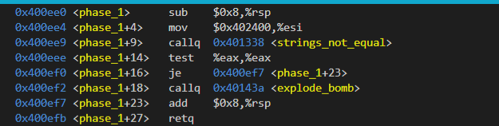

- step1: 检查input是不是和`0x402400`开始的字符串相等，如果不相等则引爆炸弹。

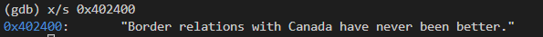

### phase 2

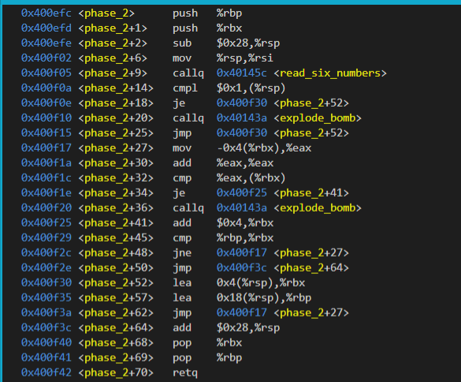

- step1: 从input中读取6个整数。

- step2: 如果第一个整数不是1，引爆炸弹。

- step3: 循环5次, 如果`x(i+1)`不是`x(i)`的2倍，则引爆炸弹。

### phase 3

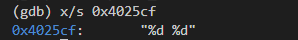

- step1：从`input`读取2个整数放入`%rsp + 8`以及`%rsp + 12`。

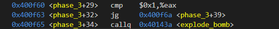

- step2: 如果`x(1)`小于0或者大于7则引爆炸弹。

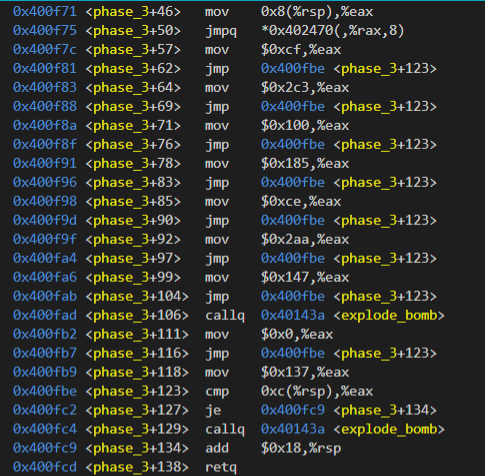

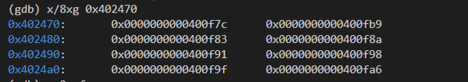

- step3: 根据x1的值，跳转到不同的地方设置`%eax`为不同的值。

- step4: 如果`%eax`不等于`x(2)`则引爆炸弹。

- 答案：`0 0xcf`, `1, 0x137`...等都可以

### phase_4

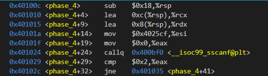

- step1: 读取2个整数放入`%rsp + 8`以及`%rsp + c`。

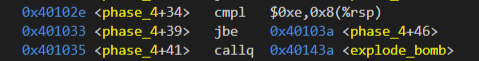

- step2: 如果`x(1)`小于0或者大于14则引爆炸弹。

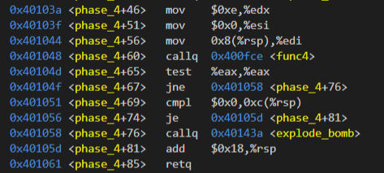

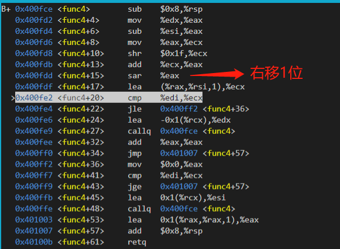

- step3: 调用`func4(x(1), 0x0, 0xe)`，如果返回值不为0则引爆炸弹。

- step4: 如果`x(2)`不是0则引爆炸弹。

- 答案：`7 0`。

### phase 5

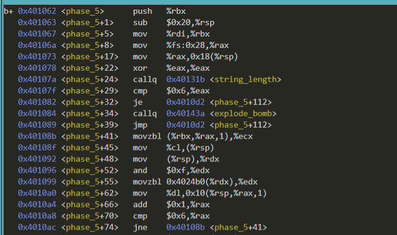

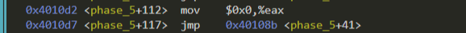

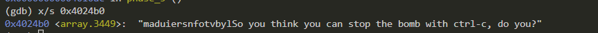

- step1: 检查input长度是不是6

- step2: 根据input中的字符从`0x4024b0`附近复制6个字符到`0x10(%rsp)`开始的栈内存。
    ```c
    for (int i = 0; i < 6; ++i)
    {
        char c = input[i];
        *(char *)(0x10(%rsp + i)) = *(char *)((0xf & c) + 0x4024b0));
    }
    ```

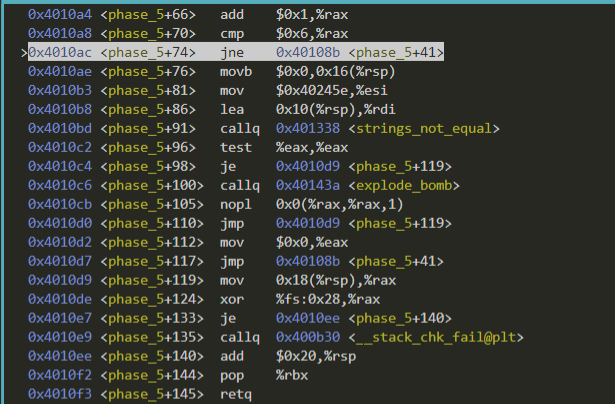

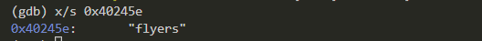

- step3: 将`0x10 + %rsp`以及`0x40245e`作为2个实参调用**strings_not_equal**。如果返回值为0，则从`phase_5`返回，否则引爆炸弹。

- 答案: 从`0x4024b0`开始的16个字符里找到`flyers`对应字符的偏移量。
    ```
    f -> 9  -> 0x39 -> '9'
    l -> 15 -> 0x3f -> '?'
    y -> 14 -> 0x3e -> '>'
    e -> 5  -> 0x35 -> '5'
    r -> 6  -> 0x36 -> '6'
    s -> 7  -> 0x37 -> '7
    ```

### phase 6

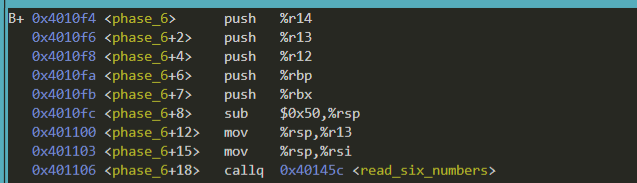

- step1: 从input字符串中读取6个int(`x1, x2, x3, x4, x5, x6`)保存到`%rsp`开始的内存中。

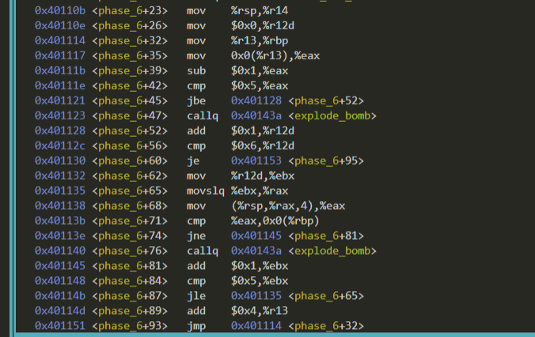

- step2: 双层循环判断6个int是否满足条件，每个int都必须属于`[1, 6]`。并且对于`xj`都有`xj != xi, j > i`。

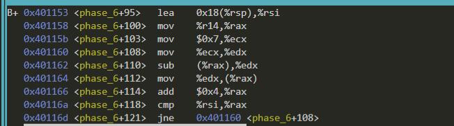

- step3: 6个int转换为`7 - xi`。

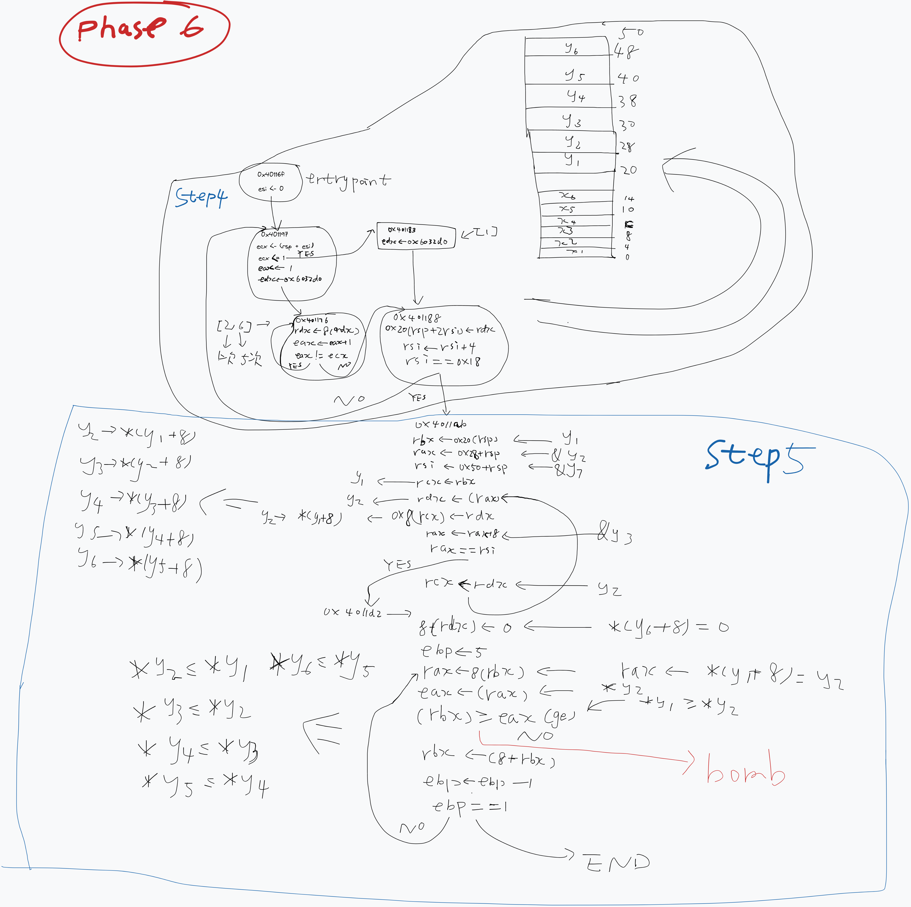

- step4: 根据6个int的值(`[1, 6]`)分别取对应的数放入`[%rsp + 20, %rsp + 50)`中的6个long中。
    ```
    1 -> 0x6032d0
    2 -> 0x6032e0
    3 -> 0x6032f0
    4 -> 0x603300
    5 -> 0x603310
    6 -> 0x603320
    ```

- step5: 第4步得到了8个long值，将它们看成`int *`(`p1, p2, p3, p4, p5, p6`)。需要满足`*pi >= *pi+1`，否则引爆炸弹。
    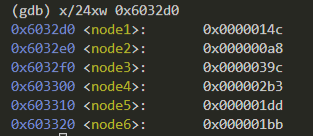
    ```
    3 > 4 > 5 > 6 > 1 > 2
    ```

- 答案：一开始输入的6个数应该导致最终结果是降序，则输入为`4 3 2 1 6 5`。


